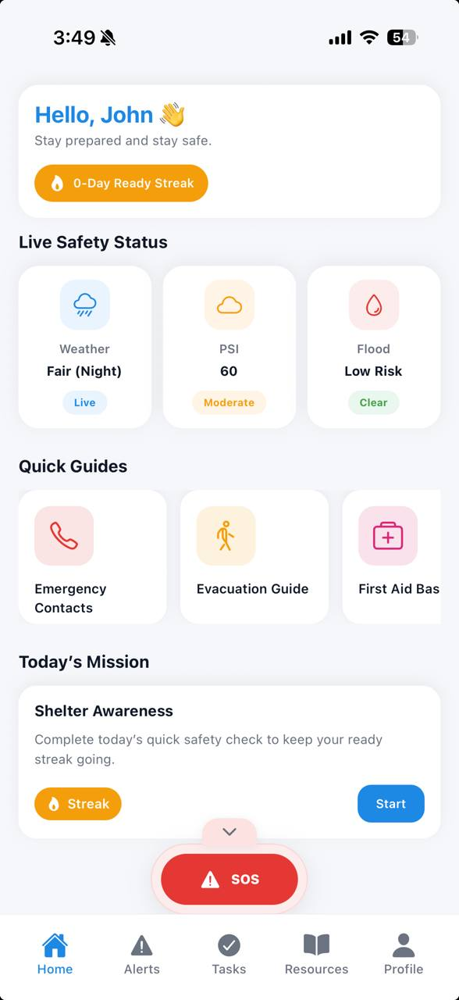
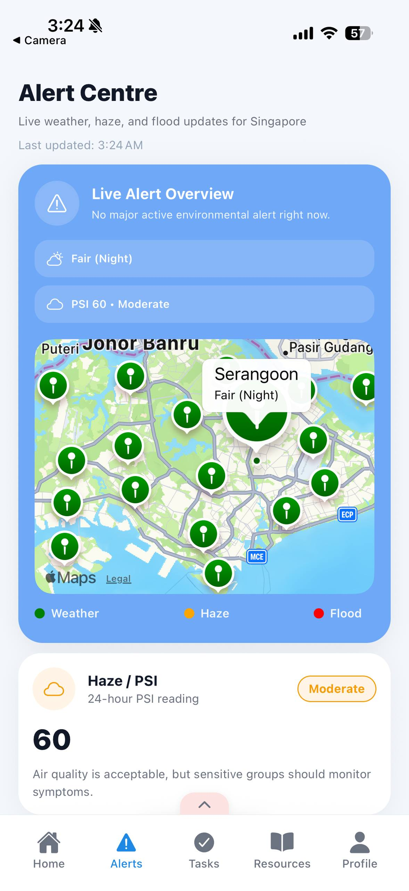
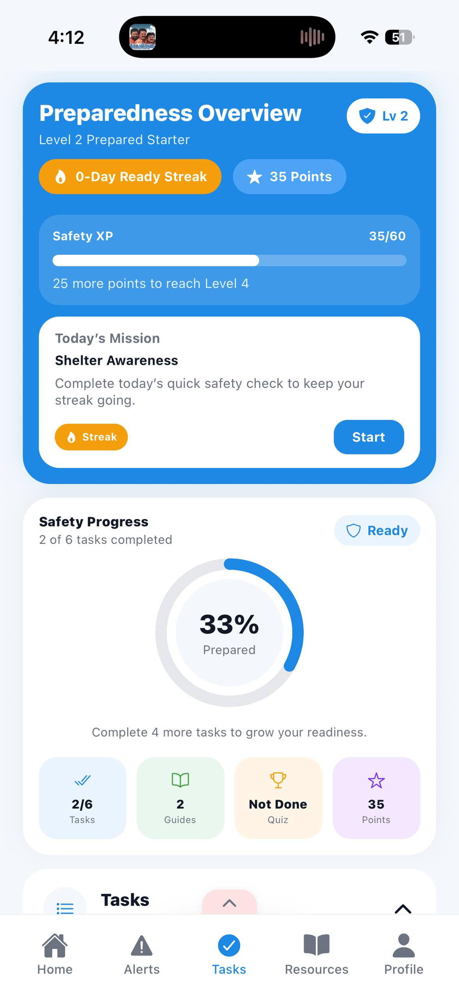

# SafeNation — Disaster Preparedness Mobile App

A mobile application built with React Native and Expo that supports disaster preparedness and emergency awareness for individuals in Singapore. SafeNation combines real-time environmental alerts, gamified preparedness tasks, emergency assistance features, and accessible safety resources into a single platform.

Built as a Final Year Project for CM3070 — University of London.

--

## Features

- **Live Safety Status** — Real-time weather, PSI air quality, and flash flood data from Singapore's data.gov.sg APIs displayed on the Home screen
- **Disaster Alerts** — Live alert centre with an embedded Singapore map showing colour-coded hazard markers for weather, haze, and flood conditions
- **Gamified Preparedness Tasks** — Six interactive mini-games including emergency kit challenge, emergency contacts match, flood safety sequencing, haze scenario quiz, shelter selection, and a final disaster quiz
- **XP and Progression System** — Earn XP points, level up, maintain daily ready streaks, and unlock achievement badges
- **Emergency Resource Hub** — Safety guides covering evacuation, first aid, disaster response, emergency kit, and family safety planning
- **SOS Emergency Screen** — One-tap access to Singapore emergency numbers (995, 999, 1777), location-based SMS alerting via Expo Location and Expo SMS
- **Push Notifications** — Daily mission reminders, streak warnings, and environmental alert notifications triggered on app launch when PSI exceeds 100 or active flood alerts are detected
- **Dark Mode** — Full dual-theme support via a global AppSettingsContext
- **Per-User Data** — All progress, contacts, and settings are scoped per user account using AsyncStorage

---

## Tech Stack

| Technology          | Purpose                                      |
| ------------------- | -------------------------------------------- |
| React Native + Expo | Cross-platform mobile development            |
| React Navigation    | Tab and stack navigation                     |
| AsyncStorage        | Local data persistence                       |
| Expo Notifications  | Push notifications                           |
| Expo Location       | GPS location for SOS                         |
| Expo SMS            | SMS alerting for SOS                         |
| React Native Maps   | Live hazard map view                         |
| React Native SVG    | Circular progress ring                       |
| data.gov.sg APIs    | Real-time weather, PSI, flood, rainfall data |
| Jest                | Unit testing                                 |

---

## Setup and Installation

### Prerequisites

- Node.js (v18 or above)
- Expo CLI
- Expo Go app on your mobile device, or an iOS/Android simulator

### Steps

1. Clone the repository:

```bash
git clone https://github.com/thepoojaharidas/safenation.git
cd safenation
```

2. Install dependencies:

```bash
npm install
```

3. Start the development server:

```bash
npx expo start
```

4. Scan the QR code with Expo Go on your device, or press `i` for iOS simulator or `a` for Android emulator.

### Running Tests

```bash
npx jest
```

All 32 unit tests across 8 test suites should pass.

## Screenshots

| Home                                           | Alerts                                               | Tasks                                       |
| ---------------------------------------------- | ---------------------------------------------------- | ------------------------------------------- |
|  |  |  |

| Resources                                             | SOS                                                   | Profile                                                               |
| ----------------------------------------------------- | ----------------------------------------------------- | --------------------------------------------------------------------- |
|  |  |  |

---

## Project Structure

```
├── screens/          # All application screens
├── services/         # API, auth, and notification service modules
├── navigation/       # AppNavigator.js
├── context/          # AppSettingsContext for global theme state
├── theme/            # lightTheme and darkTheme colour objects
├── __tests__/        # Jest unit test suite
└── assets/           # App icons and images
```

## Data Sources

All environmental data is sourced from Singapore's official open data platform:

- [data.gov.sg](https://data.gov.sg) — Weather forecast, PSI, rainfall, and flood alerts

---
